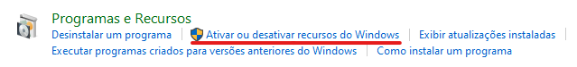
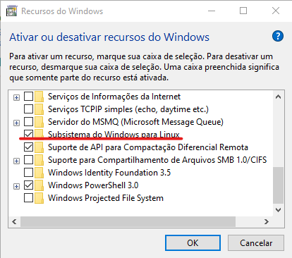
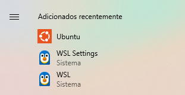
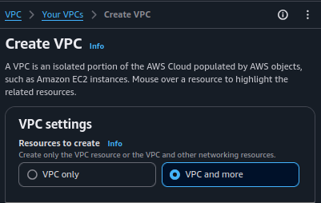
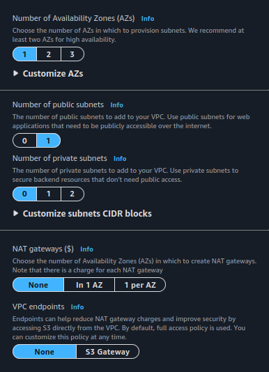
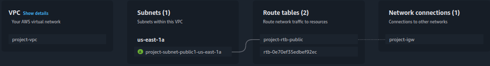
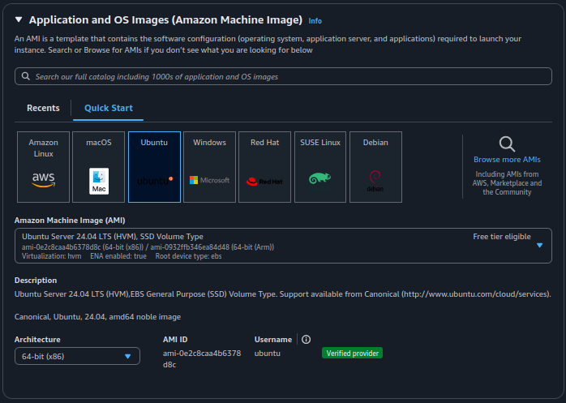
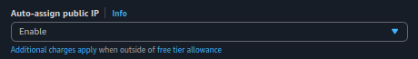

# ✨ Projeto de Estágio: Monitoramento de Servidor Nginx ✨
## 🔢 Requisitos do Projeto

1. **Subir um servidor Nginx:**
   - O servidor deve estar online e rodando corretamente.
2. **Criar um script para validação do serviço:**
   - O script deve verificar se o serviço está online e enviar o resultado da validação para um diretório definido.
   - O log deve conter:
     - Data e hora;
     - Nome do serviço;
     - Status (ONLINE ou OFFLINE);
     - Mensagem personalizada.
   - Gerar dois arquivos de saída:
     - **online.log** para registros de serviço ativo.
     - **offline.log** para registros de serviço inativo.
3. **Automatizar a execução do script:**
   - Configurar para rodar a cada 5 minutos.
4. **Versionar a atividade:**
   - Utilizar Git para controle de versões.
5. **Documentar o processo de instalação do Linux:**
   - Fornecer um guia detalhado de configuração.

---

## 🪟 Instalando WSL

1. Abra o **Painel de Controle** e acesse **Programas**.

    

2. Habilite o recurso **Subsistema do Windows para Linux** em:
   - *"Ativar ou desativar recursos do Windows"*.

        
        

3. Reinicie o computador quando solicitado.
4. Abra o **Windows PowerShell** como administrador e execute o comando:
   ```bash
   wsl --install
   ```
   - Este comando instala a distribuição padrão (*Ubuntu 24.04.1 LTS* no momento desta escrita).
5. Reinicie novamente o computador.
6. Inicie o **Ubuntu** pelo menu iniciar e finalize a configuração:
   - Defina um nome de usuário e uma senha para o Linux (podem ser diferentes do usuário do Windows).

        

---

## 🌟 Instalando Nginx

### Atualizar o sistema:
```bash
apt update
apt upgrade -y
```

### Instalar o Nginx:
```bash
apt install nginx
```
- Por padrão, o Nginx hospeda uma página de boas-vindas, suficiente para validação do script.

---

## 🔍 Monitoramento do Servidor Nginx

### 🔧 Funcionalidade do Script
O script **check-nginx.sh** verifica se um servidor Nginx está em execução e gera logs de atividade.

#### Recursos:
- **Verifica a disponibilidade** do servidor utilizando `curl`.
- **Registra logs:**
  - **found.log**: Servidor ativo.
  - **notFound.log**: Servidor inativo.
- Inclui **data e hora** em cada registro.

---

### 📐 Como Usar
O script aceita os seguintes parâmetros:

| **Parâmetro** | **Descrição** | **Padrão** |
|----------------|------------------|-------------|
| `-u` | URL do servidor | http://localhost |
| `-p` | Porta do servidor | 80 |
| `-d` | Diretório de logs | ~/nginx-project-logs |
| `-t` | Timeout da conexão (em segundos) | 10 |
| `-h` | Exibe ajuda | - |

---

### ⚙️  Automatização com Cron
Adicione a seguinte linha ao `crontab -e`:
```bash
*/5 * * * * /caminho/para/seu/script/check-nginx.sh
```
- O script será executado a cada 5 minutos, gerando logs nos arquivos especificados.

---

## ☁️ Configuração do Ambiente AWS

### 🌐 vpc
Crie um VPC, com sua devida subnet pública e route tables apontando para um internet gateway para acesso público. Por fins de simplicidade exite a seguinte opção na criação do VPC:



Assim os recursos necessarios podem ser criados automaticamente seguindo uma configuração. Por base a seguinte configuração é suficiente para o teste deste projeto:



resultado:



### 🖥️ Crie a instância EC2

O Ubuntu estará sendo usado como sistema operacional nessa demonstração:



Adicionar atribuição de IP para permitir o acesso público. Também é necessário permitir o acesso a porta 80, http.



Atribuindo o seguinte script a instalação do Nginx será feita automaticamente com o início da instância:

```bash
#!/bin/bash
apt update -y
apt upgrade -y

apt install nginx -y
systemctl start nginx
systemctl enable nginx
```

---

## 🔧 Script de Instalação localhost
O script ```install.sh``` automatiza a instalação e configuração do projeto em um ambiente local.

### 🔧 Como Executar o Script:

1. Salve o script em um arquivo chamado `install.sh`. 🖥️
2. Torne o script executável:

```bash
chmod +x install.sh
```

3. Execute o script com permissões de superusuário:

```bash
sudo ./install.sh
```

- Este script instalará os requisitos, configurará o Nginx, clonará o repositório do projeto e agendará a execução automática do script de monitoramento na CronTab do usuário. 🎯

---
